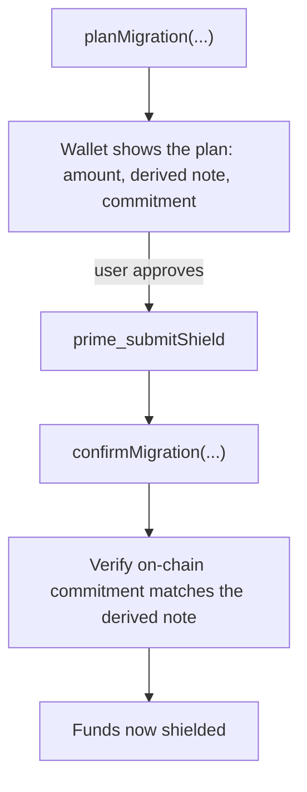

# Migrating to shielded accounts

Existing transparent balances do not become private automatically. A user moves value into the shielded pool by **shielding** it — spending a transparent balance to create a shielded note. Mersennet ships migration helpers so wallets can drive this safely, with a plan-then-confirm flow.

## The migration flow



1. **Plan** — `planMigration` computes the migration note the wallet will create, including its derived randomness and the expected note commitment, so the UI can show the user exactly what will happen before signing.
2. **Submit** — the wallet shields the funds via `prime_submitShield`, creating the new note commitment on-chain.
3. **Confirm** — `confirmMigration` checks that the on-chain commitment matches the planned note, giving the wallet a deterministic success/failure signal.

## SDK helpers

The TypeScript SDK exposes the migration surface as typed functions:

| Helper | Purpose |
|---|---|
| `planMigration` | Produce a `MigrationPlan` (amount, derived note, expected commitment) for user review. |
| `confirmMigration` | Verify the on-chain result against the plan, returning a `MigrationConfirmation`. |
| `deriveMigrationNote` | Deterministically derive the migration note from its parameters. |
| `matchesMigrationNote` | Check whether an on-chain commitment corresponds to a derived migration note. |
| `defaultNoteCommitment` | Default note-commitment hasher used when one is not supplied. |

```ts
import { planMigration, confirmMigration } from '@prime-chain/sdk';

// 1. Plan and show the user what will happen
const plan = planMigration(accounts); // accounts: MigrationNoteParams[]
// plan.notes → derived notes + expected commitments
// plan.totalsByAsset → per-asset totals for user review

// 2. Shield via RPC (prime_submitShield) using each planned note ...

// 3. Confirm the result deterministically against the scanned notes
const result = confirmMigration(accounts, scannedNotes);
if (!result.complete) {
  // surface a clear error; do not assume success
}
```

The randomness labels (`MIGRATION_RHO_LABEL`, `MIGRATION_PSI_LABEL`) are exported so wallets and tests derive identical notes.

## UX recommendations

- **Always plan before signing.** Show the amount and the derived commitment so the user can verify before funds move.
- **Confirm deterministically.** Treat a failed `confirmMigration` as a hard error, not a warning.
- **Batch carefully.** Each shielded note is independent; large balances may be split into multiple notes for better privacy and future spend flexibility.

After migrating, the wallet reconstructs the new shielded balance via [note scanning](./note-scanning.md). To later reveal a balance to a third party, use [selective disclosure](./selective-disclosure.md).
