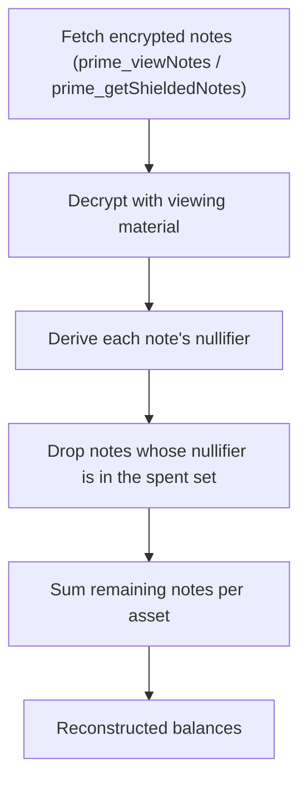

# Note scanning & wallet reconstruction

Because Mersennet never stores a plaintext balance for you, your wallet rebuilds private state **locally**. It scans the encrypted notes it is allowed to decrypt, drops the ones it has already spent, and sums what remains. There is no central indexer of your funds.

## The scan-and-reconstruct workflow



1. **Fetch** the encrypted notes the wallet (or a grantee) is authorized to see.
2. **Decrypt** each note with the owner's or grantee's viewing material.
3. **Derive nullifiers** for the decrypted notes.
4. **Filter out spent notes** by checking each nullifier against the on-chain spent-nullifier set.
5. **Sum** the unspent notes per asset to get the current balance.

## SDK primitives

The TypeScript SDK ships the full pipeline so a wallet does not implement crypto by hand:

| Helper | Purpose |
|---|---|
| `scanGrantedNotes` | Decrypt the notes a viewing grant authorizes. |
| `defaultNullifierDeriver` | Derive a note's nullifier deterministically. |
| `reconstructPortfolio` | Sum unspent notes into per-asset balances. |
| `scanAndReconstructBalances` | End-to-end: scan, derive, filter spent, and reconstruct in one call. |

```ts
import { scanAndReconstructBalances } from '@prime-chain/sdk';

const result = await scanAndReconstructBalances(
  provider,          // PrimeProvider
  viewingMaterial,   // GrantedViewingMaterial (owner or grantee)
  { limit: 100 },    // options: drives a paged prime_viewBalances scan
);

console.log(result.perAsset); // per-asset totals, spent notes excluded
```

## Why nullifiers matter here

A note you received may already have been spent. The only way to know — without a trusted server tracking your account — is to derive each note's nullifier and check it against the public spent-nullifier set. Notes whose nullifier is present are excluded from the balance. This is the same primitive that prevents double-spends in [shielded accounts](./shielded-accounts.md), reused on the read path.

## Positions and open orders

Trading state is reconstructed the same way, over the wallet's local order and fill records:

- `reconstructPositions` — net positions per market.
- `reconstructOpenOrders` — resting open orders per market.

These power both your own wallet view and grant-gated [selective disclosure](./selective-disclosure.md) reads. See the [Shielded SDK](../developers/privacy/shielded-sdk.md) for the complete API.
