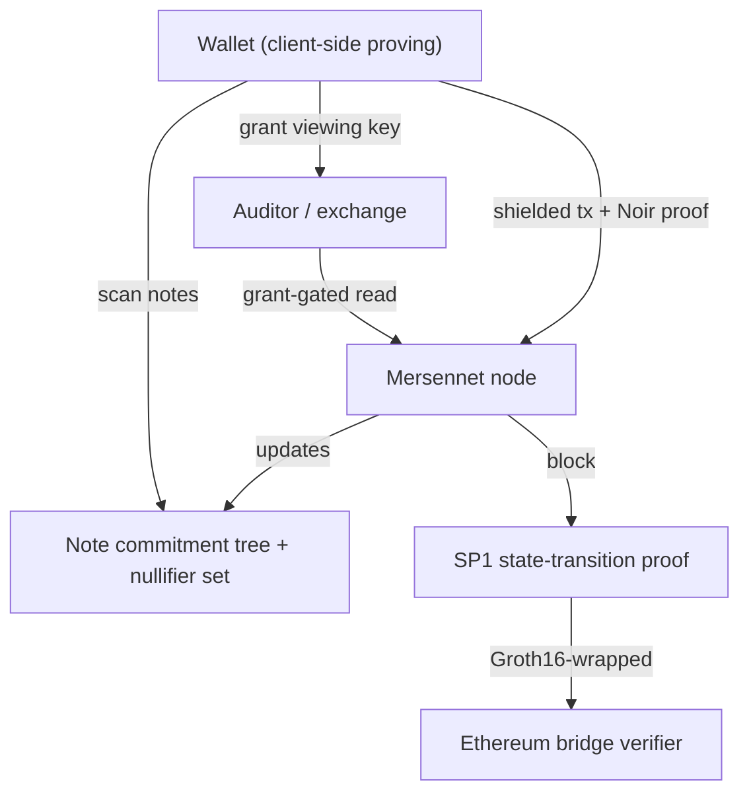

# Privacy on Mersennet

Mersennet is a zero-knowledge Layer 1 where **privacy and verifiability are the defaults**. Instead of bolting a mixer onto a transparent chain, Mersennet provides *account-level* privacy across both the EVM and the native central limit order book (CLOB) — Aztec-style — while keeping the chain publicly verifiable through succinct proofs.

## What "account-level privacy" means

On a transparent chain, anyone can read your balances, positions, and order flow from the public state. On Mersennet, that information lives in **shielded accounts**: balances, transfers, positions, and orders are represented as encrypted *notes* committed to an on-chain Merkle tree. The network can verify that every state transition is valid without learning *who* owns what.

| Surface | Transparent chain | Mersennet shielded |
|---|---|---|
| Balances | Public per address | Encrypted notes, owner-only |
| Transfers | Sender, recipient, amount public | Nullifier in / commitment out, amounts hidden |
| Leverage positions | Public, openly liquidatable | Private, solvency proven in ZK |
| Order flow | Public mempool + book | Threshold-encrypted intents |

## The four pillars

- **[Shielded accounts](./shielded-accounts.md)** — balances, transfers, positions, and order flow are concealed using notes, commitments, and nullifiers.
- **[Risk checks in zero knowledge](./zk-risk-checks.md)** — leverage without open liquidations: solvency and margin are proven with ZK proofs instead of public liquidation auctions.
- **[Selective disclosure](./selective-disclosure.md)** — grant a scoped viewing key to an auditor, exchange, or counterparty and reveal exactly what you choose.
- **[Verifiable state](./state-proofs.md)** — every block's state transition is proven with SP1 and verified on-chain through a Groth16 bridge, enabling trustless light clients.

## How it fits together

## Where to go next

- Building a wallet or app? Start with the **[Shielded SDK](../developers/privacy/shielded-sdk.md)** and the **[Shielded JSON-RPC reference](../developers/privacy/shielded-rpc.md)**.
- Want the formal protocol? See the **[Whitepaper](../whitepaper.md)**.
- Moving funds from transparent to shielded? See **[Migrating to shielded accounts](./migration.md)**.

:::note Activation
Shielded features are gated by the privacy hard fork. Before activation, mutation methods return error `-32605` ("method disabled in current chain mode") and read methods return empty values. See [Verifiable state](./state-proofs.md) and the [activation runbook](../whitepaper.md) for details.
:::
