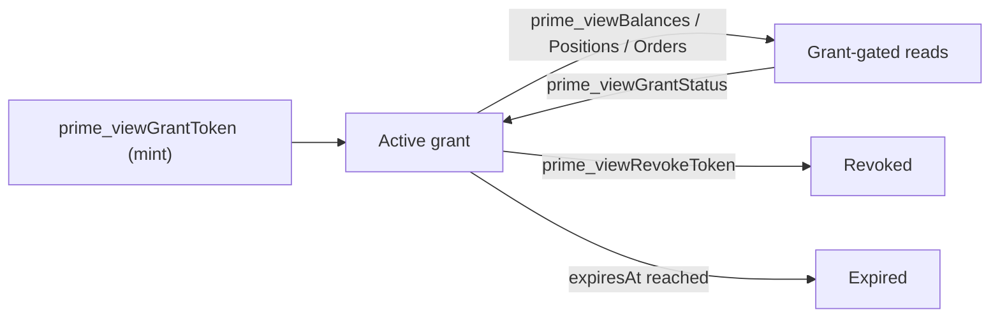

# Selective disclosure & viewing grants

Privacy by default does not mean opacity. Mersennet lets an account holder **grant a scoped viewing key** to an auditor, exchange, or counterparty that reveals exactly the data they need — and nothing else. The rest of the account stays shielded.

## Viewing grants

A viewing grant is a capability you mint and hand to a grantee. It is **scoped**, **time-bounded**, and **revocable**.

- **Scoped** — each grant authorizes one or more read scopes: `balances:read`, `positions:read`, `orders:read`.
- **Time-bounded** — grants carry an expiry; reads fail once expired.
- **Revocable** — the grantor can revoke at any time, immediately invalidating future reads.

```ts
// Grant a scoped, expiring viewing key
const grant = await wallet.createGrant({
  scope: ['balances:read', 'positions:read'],
  grantee: auditorPubKey,
  expiresAt: '2026-12-31',
});

// The grantee reconstructs only what was shared
const view = await rpc.viewBalances(grant.id);
```

## Lifecycle



| Step | Method | Purpose |
|---|---|---|
| Mint | `prime_viewGrantToken` | Create a scoped, expiring grant for a grantee. |
| Status | `prime_viewGrantStatus` | Check whether a grant is active, expired, or revoked. |
| Read balances | `prime_viewBalances` | Grant-gated `balances:read` reconstruction read. |
| Read positions | `prime_viewPositions` | Grant-gated `positions:read` reconstruction read. |
| Read orders | `prime_viewOrders` | Grant-gated `orders:read` open-order reconstruction read. |
| Revoke | `prime_viewRevokeToken` | Invalidate the grant immediately. |

## The node never decrypts your data

Grant-gated reads are **authorization gates, not decryption oracles**. For balances, `prime_viewBalances` returns the *encrypted* notes the grantee is authorized to see (paginated), and the grantee runs `reconstructPortfolio` client-side — the node never decrypts a balance. Position and order reads return the public per-market clearing context plus the records needed for the grantee to run `reconstructPositions` / `reconstructOpenOrders` locally, authorized by the grant.

This keeps the trust model honest: a viewing grant lets a specific party recompute a specific view, without ever placing your plaintext on the server.

## Build it

See [Note scanning & wallet reconstruction](./note-scanning.md) for the client-side reconstruction primitives, the [Shielded SDK](../developers/privacy/shielded-sdk.md) for typed helpers (`scanGrantedNotes`, `reconstructPortfolio`, `reconstructPositions`, `reconstructOpenOrders`), and the [Shielded JSON-RPC reference](../developers/privacy/shielded-rpc.md) for the full method signatures.
