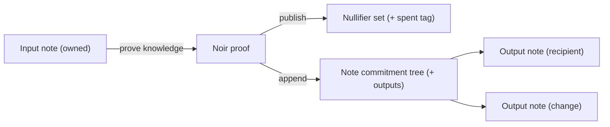

# Shielded accounts

A shielded account is not an address with a public balance. It is a set of **notes** — encrypted records of value — that only the owner (and anyone they explicitly authorize) can read. The chain tracks notes through cryptographic commitments and spends them through nullifiers, so it can guarantee correctness without learning ownership.

## Notes, commitments, nullifiers

| Primitive | Role |
|---|---|
| **Note** | An encrypted record holding an asset, amount, owner public key, and randomness (`rho`, `psi`/salt). |
| **Commitment** | A hiding, binding hash of a note, appended to the on-chain **note commitment tree**. Reveals nothing about contents. |
| **Nullifier** | A deterministic, unlinkable tag derived from a note's secret. Publishing it marks the note spent and prevents double-spends — without revealing *which* commitment it corresponds to. |

When you spend value, your wallet:

1. Proves (in zero knowledge) that it knows a note in the commitment tree.
2. Publishes that note's **nullifier** to retire it.
3. Creates new output **commitments** for the recipient and any change.

The node verifies the proof, checks the nullifier is not already in the **nullifier set**, and appends the new commitments. Balances, parties, and amounts never appear in the clear.

## What stays private vs. public

**Private:** balances per asset, transfer amounts, sender/recipient linkage, position size and direction, individual order prices and sizes.

**Public (by design):** the note commitment tree root, the nullifier set, aggregate market statistics (e.g. last clearing price and matched size for a batch auction tick), and the existence of state transitions. These public values are *address-free by construction* — Mersennet's CI enforces that no address fields leak into shielded events.

## The transparent ↔ shielded bridge

Value enters and leaves the shielded pool through two operations:

- **Shield** (`prime_submitShield`) — move funds from a transparent EOA into a new shielded note commitment.
- **Unshield** (`prime_submitUnshield`) — spend a shielded note (publishing its nullifier) and credit a transparent EOA.

Inside the shielded pool, **shielded transfers** (`prime_submitShieldedTransfer`) move value between notes with full privacy.

See [Migrating to shielded accounts](./migration.md) for the recommended UX flow, and the [Shielded JSON-RPC reference](../developers/privacy/shielded-rpc.md) for payload formats.

## Reconstructing your own state

Because the node never stores a plaintext balance for you, your wallet rebuilds private state locally by **scanning notes** and tracking which ones you have spent. See [Note scanning & wallet reconstruction](./note-scanning.md).
