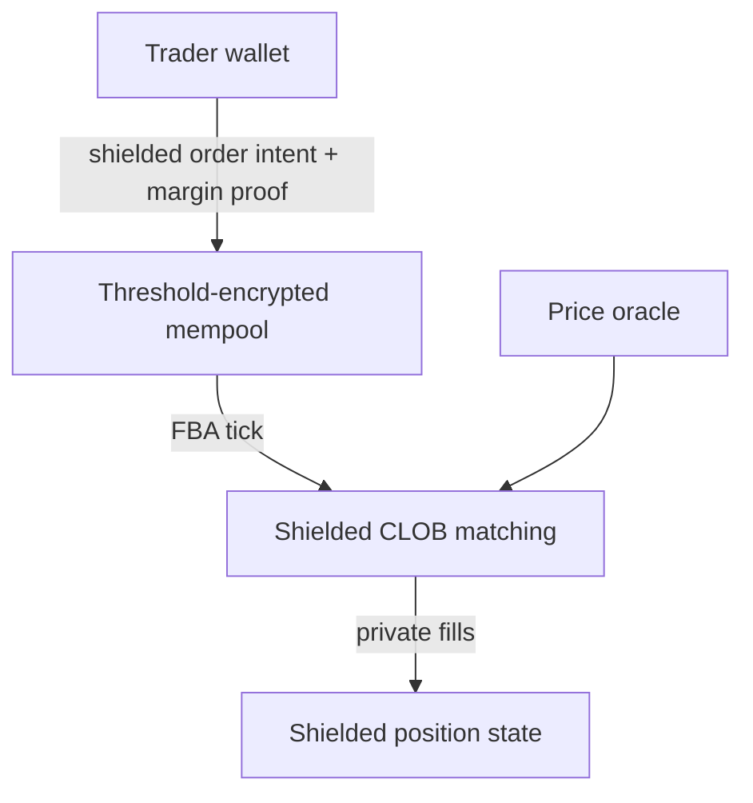

# Risk checks in zero knowledge

Leverage trading normally requires the chain — and the whole market — to *see* every position so that under-collateralized accounts can be liquidated. Mersennet keeps positions private and instead proves the risk properties that matter in **zero knowledge**.

## The problem with open liquidations

On a transparent perps venue:

- Every position's size, entry, and liquidation price are public.
- Liquidations are open auctions, so positions get hunted and front-run.
- MEV searchers profit from your liquidation, not just the protocol.

This leaks strategy and creates predatory dynamics. Mersennet removes the public surface while preserving solvency guarantees.

## Solvency as a proof, not a disclosure

When a trader opens or modifies a leveraged position in the shielded CLOB, the wallet submits a proof that the position satisfies the margin rules at the current oracle price — **without revealing the position itself**. The chain learns only "this position is adequately margined," not its size or direction.

## Liquidations without exposure

Liquidations are handled by **bonded liquidators** through a threshold-encrypted auction, not an open mempool race:

1. A liquidator registers once with a Pedersen bond commitment (`prime_registerLiquidator`), posting at least the minimum bond (10,000 PRIM).
2. When a position becomes liquidatable at the oracle price, a registered liquidator submits an encrypted claim (`prime_submitLiquidationClaim`).
3. The auction winner submits the execution (`prime_submitLiquidationExecute`), which settles the victim's nullifier and mints the bounty and insurance commitments.

Because claims and bids are threshold-encrypted, the target position is never broadcast in the clear, and liquidators cannot front-run one another from the public mempool.

## Why this is safe

- **Solvency is enforced** — the margin proof is checked by the chain; an invalid position cannot be admitted.
- **No double-spend** — liquidation settles the position's nullifier, the same primitive that protects [shielded accounts](./shielded-accounts.md).
- **Verifiable end to end** — the resulting state transition is captured in the block's [SP1 state proof](./state-proofs.md).

See the [Shielded JSON-RPC reference](../developers/privacy/shielded-rpc.md) for the exact liquidation and order payloads.
