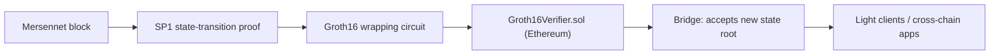

Privacy is only half of the design. The other half is **verifiability**: anyone should be able to confirm that Mersennet's state evolved correctly, from a succinct proof, without trusting a full node. Mersennet does this by proving each block's state transition with **SP1** and verifying it on Ethereum through a **Groth16** bridge.

## State transition proofs (SP1)

For each block, a prover runs the Mersennet state-transition program inside [SP1](https://docs.succinct.xyz) (a RISC-V zkVM) and produces a proof that:

- The previous state root transitions to the new state root under the block's transactions.
- The previous nullifier root transitions to the new nullifier root (no double-spends).
- The market state hash and block hash are consistent.

The proof and its public outputs are retrievable over JSON-RPC:

```bash
# Fetch the latest state-transition proof
curl -s http://46.225.30.187:8545 \
  -H 'content-type: application/json' \
  -d '{"jsonrpc":"2.0","id":1,"method":"prime_getLatestStateProof","params":[]}'
```

```json
{
  "blockHeight": 500,
  "prevStateRoot": "0x…",
  "newStateRoot":  "0x…",
  "prevNullifierRoot": "0x…",
  "newNullifierRoot":  "0x…",
  "blockHash":     "0x…",
  "newMarketStateHash": "0x…",
  "txCount": 12,
  "proofBincodeHex": "0x…",
  "proofType": "SP1"
}
```

A stateless verifier is available as `prime_verifyStateProof`, and `prime_getStateProof` fetches the proof for any specific block.

## The Ethereum bridge (Groth16)

To anchor Mersennet on Ethereum, the SP1 proof is **wrapped into a Groth16 proof** and submitted to an on-chain verifier. This lets an Ethereum contract — and therefore any Ethereum-based light client — accept Mersennet state roots as soon as a valid proof is verified.



The bridge contract consumes the proof together with the block program's public outputs (encoded as field elements) and, on success, records the verified state root. The chain-side path that prepares this calldata and the on-chain verification precompile are part of the protocol's verifiable-state workstream.

## Why this enables light clients

A light client does not need to re-execute Mersennet or trust a specific RPC provider. It only needs to:

1. Obtain the latest state proof (`prime_getLatestStateProof`).
2. Verify it (`prime_verifyStateProof`, or via the Ethereum Groth16 verifier).
3. Trust the resulting state root.

This is the foundation for trustless bridges, cross-chain messaging, and independent verification of the chain's privacy invariants.

## Activation

State proofs and the bridge are part of the privacy hard fork. Before activation, blocks may not carry a proof; in that case proof reads return `{ "blockHeight": …, "proof": null, "reason": … }`. See the [Shielded JSON-RPC reference](/developers/privacy/shielded-rpc/) for exact response shapes.
