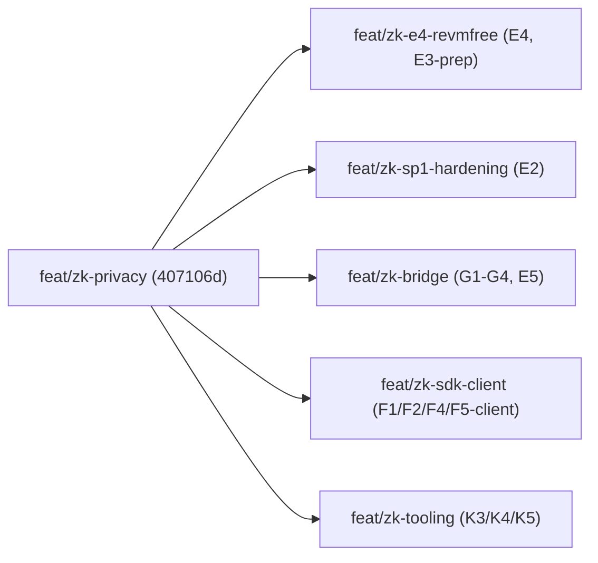

# Mersennet Privacy Fork — Consolidation & Close-Out

**Audience:** Rodolfo Cova (merge owner) and the workstream owners in `.github/CODEOWNERS`.
**Purpose:** one authoritative handoff for finishing the zk privacy fork. It tells you how to consolidate the five feature branches, how to prove the consolidated tree is green, the true status of every workstream after the merge, and exactly what is left (and why none of it is buildable inside the dev sandbox).

> TL;DR — almost everything is **done in code** but lives on five **unmerged** branches stacked on `feat/zk-privacy` (still at base `407106d`). The branches are **disjoint at the file level**, so the merge is conflict-free. The genuine remainder is **resource-gated** (prover hardware, a Succinct account, the separate `prime-trade` repo, audit funding, the 8-week bake, a governance vote), not code-gated.

---

## 0. Branch map

| Branch | Workstreams | Footprint |
|---|---|---|
| `feat/zk-e4-revmfree` | E4 (revm-free SP1 host), E3 prep | `crates/state-proof/*` (new crate), `crates/core/{Cargo.toml,zk_proofs.rs,zk_sp1.rs}`, `programs/state-transition-host/*`, root `Cargo.toml`/`Cargo.lock`, `scripts/zk/*`, `docs/STATUS.md`, `docs/security/privacy-fork-audit-packet.md` |
| `feat/zk-sp1-hardening` | E2 hardening | `crates/core/src/engine.rs`, `crates/core/src/liquidation_auction.rs`, `crates/zkp/src/sp1.rs` |
| `feat/zk-bridge` | G1-G4, E5 | `contracts/src/zk/*`, `contracts/test/zk/*` |
| `feat/zk-sdk-client` | F1, F2, F4, F5 (client-side) | `sdk/*` only |
| `feat/zk-tooling` | K3, K4, K5 | `.github/workflows/ci.yml`, `Dockerfile.dev` |

No file is touched by more than one branch (verified with `git diff --name-only feat/zk-privacy..<branch>` across all five — the intersection is empty).



---

## 1. Merge runbook

Recommended order: Rust-core first (so the workspace compiles before the satellites land), then contracts / SDK / CI. Any order works because the branches share no files; this order just minimizes the time the tree is half-built.

```bash
git checkout feat/zk-privacy
git pull --ff-only

git merge --no-ff feat/zk-e4-revmfree     # new mersennet-state-proof crate + Cargo.lock + STATUS/audit-packet
git merge --no-ff feat/zk-sp1-hardening   # engine.rs / sp1.rs / liquidation_auction.rs
git merge --no-ff feat/zk-bridge          # contracts/src/zk/* + foundry tests
git merge --no-ff feat/zk-sdk-client      # sdk/* (F1 WASM prover, F2 scanner, F4 migration, F5 client reconstruction)
git merge --no-ff feat/zk-tooling         # .github/workflows/ci.yml + Dockerfile.dev
```

### What to expect
- **Zero textual conflicts.** The branches are disjoint at the file level, so none of the five merges should report a conflict.
- **One semantic integration to watch.** `feat/zk-e4-revmfree` relocates the proof-envelope types into a new `mersennet-state-proof` crate and leaves re-export shims:
  - `crates/core/src/zk_proofs.rs` -> `pub use mersennet_state_proof::zk_proofs::*;`
  - `crates/core/src/zk_sp1.rs` -> `pub use mersennet_state_proof::zk_sp1::*;`

  `feat/zk-sp1-hardening` edits `crates/core/src/engine.rs` and `crates/zkp/src/sp1.rs`, which consume those types via the `mersennet::zk_proofs` / `mersennet::zk_sp1` paths. Git will not flag this because the files differ, but the **combined tree must build**. Run the full verification matrix (section 2) immediately after the E4 + E2 pair before continuing.
- **`contracts/lib/`** (forge-std) is an untracked local install — do **not** stage it. Foundry repopulates it via `forge install` / submodules.

---

## 2. Post-merge verification matrix

These must all pass on the consolidated `feat/zk-privacy` before the branch is considered green. (These mirror the lanes in `.github/workflows/ci.yml` so local + CI agree.)

```bash
# Rust core + node, prover + SP1 features
cargo check -p mersennet-node --features prover,sp1

# SP1 guest program + host (mock and real-sp1 local prover path)
cargo check --manifest-path programs/state-transition/Cargo.toml
cargo test  --manifest-path programs/state-transition-host/Cargo.toml
cargo check --manifest-path programs/state-transition-host/Cargo.toml --features real-sp1

# c-kzg single-version proof (E4): no revm in the host graph, one c-kzg in node graph
cargo tree -p mersennet-node --features prover,sp1 -i c-kzg

# Lint + dependency audit
cargo clippy --workspace --all-targets -- -D warnings
cargo audit

# SDK (F1/F2/F4/F5 client)
( cd sdk && npm ci && npm test && npx tsc --noEmit )

# Contracts (G1-G4 / E5)
( cd contracts && forge build --sizes && forge test -vvv )

# Privacy-invariant grep guard
bash scripts/ci/check-privacy-invariants.sh
```

Expected pre-existing exceptions (do not block the merge on these — they predate this work and are tracked separately):
- Two `state_proof` tests can fail under `--features sp1` (`invalid block tx encoding`, `shielded event root mismatch`) on branches that do not yet carry the E2 parity fixes. After `feat/zk-sp1-hardening` is merged, re-run `cargo test -p mersennet --features sp1` and confirm they pass; if they still fail, the failure is the known parity gap, not a regression from consolidation.

---

## 3. Reconciled STATUS (paste-ready)

`docs/STATUS.md` on `feat/zk-privacy` is synced to `460b002`, which predates all five branches — that is the only reason it shows so many rows as pending. After consolidation, update the header and the rows below.

Header:

```
**Last sync:** <merge date> (commit <consolidated HEAD>)
```

Row reconciliation (status after consolidation, and the branch that satisfies it):

| ID | New status | Source branch / note |
|---|---|---|
| E2 | ✅ | `feat/zk-sp1-hardening` — witness-bearing prove path, FBA/order/liquidation replay, `shielded_event_root` |
| E3 | 🟡 (prep done; real transcript gated) | `feat/zk-e4-revmfree` pins expected output + pre-fills `scripts/zk/sp1-verify-request.request.json`; real prove run is hardware-gated (see section 4) |
| E4 | 🟡 (conflict resolved; network proof gated) | `feat/zk-e4-revmfree` — revm-free `mersennet-state-proof` crate removes the `c-kzg` link clash; `--features network` builds; one delegated proof still needs a Succinct account |
| E5 | ✅ | `feat/zk-bridge` — Groth16 verifier wired to bridge |
| F1 | ✅ | `feat/zk-sdk-client` — WASM Noir prover |
| F2 | ✅ | `feat/zk-sdk-client` — owner-side note scanner |
| F3 | ⬜ (separate repo) | `PrimeNumbersLabs/prime-trade` — out of this repo |
| F4 | ✅ | `feat/zk-sdk-client` — migration UX |
| F5 | 🟡 | `feat/zk-sdk-client` — selective-disclosure grants + **client-side** `reconstructOpenOrders`/`reconstructPositions` shipped; chain-level note-minting + `prime_viewPositions`/`prime_viewOrders` RPC intentionally deferred (decision: skip until post-audit) |
| G1 | ✅ | `feat/zk-bridge` — `PrimeChainVerifier` (Groth16) |
| G2 | ✅ | `feat/zk-bridge` — `PrimeChainBridge` state-proof verifier + deposit/withdraw |
| G3 | ✅ | `feat/zk-bridge` — Foundry test suite |
| G4 | ✅ | `feat/zk-bridge` — audit-prep pass |
| K3 | ✅ | `feat/zk-tooling` — coverage lane in CI |
| K4 | ✅ | `feat/zk-tooling` — `Dockerfile.dev` |
| K5 | ✅ | `feat/zk-tooling` — `cargo doc` publish |

Rows that legitimately remain non-done after consolidation, with the reason: **E3** (real prove run), **E4** (network proof), **F3** (separate repo), **H6** (8-week bake clock), **I1-I6** (audit funding/engagement), **J1-J6** (governance vote + activation). All detailed in section 4.

---

## 4. Close-out checklist — the genuine remainder

None of these are buildable in the dev sandbox (no prover-class hardware, no external network, no audit budget, no governance authority). Each item below is turnkey: the unblock action, the owner, and the command.

### E3 — release-grade SP1 prove/verify transcript
- **State:** prep complete. Expected public output is pinned in `docs/security/privacy-fork-audit-packet.md`; `scripts/zk/sp1-verify-request.request.json` is pre-filled with deterministic roots/hashes, leaving only `proofBytesHex` and `programElfPath` to fill from a real run.
- **Needs:** a machine with 28GB+ RAM and the SP1 toolchain (`sp1up`).
- **Owner:** `@PrimeNumbersLabs/zk`, `@PrimeNumbersLabs/docs`.
- **Do:**
  ```bash
  cd programs/state-transition && cargo-prove prove build
  cargo-prove prove vkey --elf target/elf-compilation/riscv64im-succinct-zkvm-elf/release/mersennet-state-transition

  PRIME_SP1_MODE=local cargo run --release \
    --manifest-path programs/state-transition-host/Cargo.toml --features real-sp1 -- \
    --prove-request scripts/zk/sp1-prove-request.request.json \
    --prove-response scripts/zk/sp1-prove-response.json

  PRIME_SP1_MODE=local cargo run --release \
    --manifest-path programs/state-transition-host/Cargo.toml --features real-sp1 -- \
    --verify-request scripts/zk/sp1-verify-request.request.json \
    --verify-response scripts/zk/sp1-verify-response.json
  ```
  (On Windows, drive the same commands through `PRIME_SP1_HOST_EXECUTOR=wsl`.)
- **Exit:** public values in the response match the pinned set in the audit packet; the pinned `PRIME_SP1_VKEY_HASH` matches the freshly built ELF; transcript attached to the audit packet. E3 is independent of the E4 network cut-over.

### E4 — `ProverClient::network()` cut-over (final delegated proof)
- **State:** the `c-kzg` link conflict between `revm` (1.x) and `sp1-sdk/network` (2.x) is resolved — the host no longer depends on `revm` (it depends on the revm-free `mersennet-state-proof` crate). `cargo check --features network` resolves to a single `c-kzg 2.x`.
- **Needs:** `crates.io` access (to download the `network` feature deps) plus a Succinct network account/API key.
- **Owner:** `@PrimeNumbersLabs/zk`.
- **Do:**
  ```bash
  cargo check --manifest-path programs/state-transition-host/Cargo.toml --features network
  PRIME_SP1_MODE=network SP1_PRIVATE_KEY=<key> cargo run --release \
    --manifest-path programs/state-transition-host/Cargo.toml --features network -- \
    --prove-request scripts/zk/sp1-prove-request.request.json \
    --prove-response scripts/zk/sp1-prove-response.json
  ```
- **Exit:** `PRIME_SP1_MODE=network` produces a verifiable proof against the real host path; documented in the audit packet. Until then the host fails loudly rather than silently falling back.

### F3 — PrimeTrade shielded order UI
- **State:** lives in `PrimeNumbersLabs/prime-trade`; nothing to build in this repo.
- **Owner:** front-end team on `prime-trade`.
- **Integration contract to hand over** (all shipped on `feat/zk-sdk-client`): the SDK note scanner (F2), the WASM Noir prover (F1), the migration UX helpers (F4), and `reconstructOpenOrders` / `reconstructPositions` from `sdk/src/positions.ts`, plus the grant-token lifecycle (`prime_viewGrantToken` / `prime_viewRevokeToken` / `prime_viewGrantStatus` / `prime_viewNotes`).
- **Exit:** PrimeTrade can submit a `0x7E` shielded order, scan for owned notes, and render reconstructed positions/orders against a privacy testnet node.

### H6 — 8-week pre-mainnet bake
- **State:** checklist drafted; clock has not started.
- **Needs:** all E blockers cleared (E3 transcript + E4 network proof) and the audit cycle funded — this is calendar-gated, not code-gated.
- **Owner:** `@PrimeNumbersLabs/core`, `@PrimeNumbersLabs/docs`.
- **Do:** execute the T-8 activation lane in `docs/runbooks/zk-fork-activation.md`; restart chain 131071 on the candidate release using `testnet/scripts/bootstrap-privacy-genesis.sh`; rerun the section-2 SP1 lanes every two weeks; capture bake evidence in `docs/STATUS.md`.
- **Exit:** STATUS H6 moves from "checklist drafted" to an active bake with a start date; incident-free through the full 8-week window.

### I1-I6 — third-party audit
- **State:** audit packet largely assembled in `docs/security/privacy-fork-audit-packet.md` (+ `cryptography-spec.md`, `privacy-invariants.md`, `SECURITY_AUDIT.md`).
- **Needs:** funding + auditor engagement; gated on E being complete and I0 assembled.
- **Owner:** `@PrimeNumbersLabs/zk`, `@PrimeNumbersLabs/core`, `@PrimeNumbersLabs/contracts`, `@PrimeNumbersLabs/docs`.
- **Do:** refresh CI/static-analysis evidence (section 2) at hand-off; kick off crypto (I1), protocol (I2), Solidity (I3) scopes; launch the ImmuneFi bounty (I4); run the fix cycle (I5) and re-audit (I6).
- **Exit:** all external findings fixed, documented, and re-verified.

### J1-J6 — governance + activation
- **State:** activation runbook drafted in `docs/runbooks/zk-fork-activation.md`.
- **Needs:** an on-chain activation vote, a validator upgrade schedule, comms, and authority to execute — not a code task.
- **Owner:** `@PrimeNumbersLabs/core`.
- **Do:** run the activation vote (J1), publish the validator upgrade schedule (J2) and comms (J3), execute the runbook (J4), open the deprecation window (J5), and file the post-mortem (J6).
- **Exit:** privacy fork activated at the agreed height with validators upgraded and the transparent path deprecated on schedule.

---

## 5. What was explicitly NOT done (and why)
- **Branch merges** — left to Rodolfo per his instruction; section 1 is the runbook.
- **In-place `docs/STATUS.md` edit** — the truthful status depends on the merge that has not happened yet, so the reconciled rows ship here (section 3) instead of editing a branch that does not yet reflect the consolidated tree.
- **F5 chain-level note-minting + `prime_viewPositions`/`prime_viewOrders` RPC** — intentionally skipped (decision: revisit post-audit). It is consensus-critical and would change the note format; the client-side reconstruction on `feat/zk-sdk-client` covers the wallet UX in the meantime.
