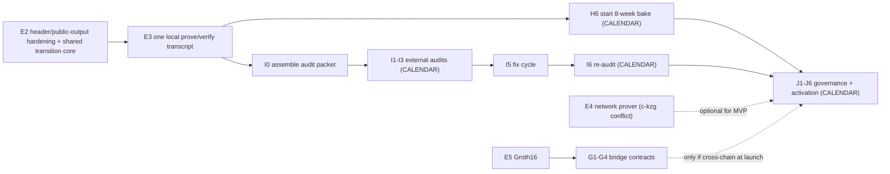

# Mersennet Privacy Fork — Remaining Work Assessment

**Branch under assessment:** `feat/zk-privacy`
**This document lives at:** `docs/delivery/privacy-fork-remaining-work.md` (originally authored on branch `docs/remaining-work-assessment`)
**Date:** 2026-05-31
**Author role:** principal engineer / delivery lead

This is a decision-oriented assessment of everything left to finish the
privacy fork. It is grounded in the canonical in-repo docs
([README.md](../../README.md), [docs/STATUS.md](../STATUS.md),
[docs/security/privacy-fork-audit-packet.md](../security/privacy-fork-audit-packet.md),
[SECURITY_AUDIT.md](../../SECURITY_AUDIT.md), [CONTRIBUTING.md](../../CONTRIBUTING.md),
[docs/runbooks/privacy-testnet-bootstrap.md](../runbooks/privacy-testnet-bootstrap.md),
[docs/runbooks/zk-fork-activation.md](../runbooks/zk-fork-activation.md),
[ADR-019](../adr/ADR-019-selective-disclosure-viewing-keys.md)) plus direct
code and git inspection. Where the answer is "this lives in another repo,"
that is called out explicitly.

It uses the repo's existing workstream naming (A–K).

---

## 1. Executive assessment

The privacy fork is **engineering-complete on the chain core and the
testnet plumbing, and is now gated on one real SP1 proof transcript plus
calendar-bound bake / audit / governance gates for mainnet.**

Concretely:

- Chain ID **131071 boots today** from
  [testnet/scripts/bootstrap-privacy-genesis.sh](../../testnet/scripts/bootstrap-privacy-genesis.sh),
  auto-activates privacy at a configured height, and runs the full
  shielded flow — orders/FBA, sealed-bid liquidations, transfers,
  shield/unshield — over RPC/WS, with Prometheus + Grafana metrics.
- The real `PRIME_SP1_MODE=local` prove/verify transcript (previously the
  single biggest hard engineering blocker) is now **captured**: a
  reproducible Docker ELF (verifying-key hash
  `0013c6c783c5266f4b361816fb1d25c186582811b90a11edcd15d69ee286200d`) was
  proved (`core`) and cryptographically verified
  (`scripts/zk/sp1-prove-response.json`, `scripts/zk/sp1-verify-response.json`).
  E3 is closed.
- The **client / wallet layer** (F1 WASM prover, F2 note scanner, F4
  migration UX) and the **Ethereum bridge** (G1–G4) are not started.
- **Audits (I)** and **governance (J)** are calendar / external gates.
  They can be procured and scheduled in parallel, but they cannot be
  compressed.

Bottom line: a private partner demo is ~2–3 weeks out, a public testnet
beta ~4–6 weeks of engineering (overlapping the bake), and mainnet is
~3–5 months out, dominated by the fixed 8-week bake and the external
audit calendar.

---

## 2. Done vs remaining (by workstream)

Legend: ✅ done · 🟡 in progress · ⬜ not started · 🔒 gated on external
dependency.

### Done and verified

- **A1–A8** — state + snapshot (`Block` schema, shielded subsystems,
  `apply_shielded_tx`, `run_shielded_tick`, `0x7E` envelope,
  `MigrationPlan::apply`, `ShieldedPersistence`, `PZS1` snapshot envelope).
- **B1–B5** — shielded subsystems (`ShieldedState`, `ShieldedOrdersEngine`
  + FBA, `LiquidationAuction`, `ThresholdMempool`, `ShieldedEvm` bridge).
- **C1–C4** — shielded RPC router + privacy-gated mutations + WS
  subscriptions + `prime_getStateProof(blockNumber)`.
- **D1–D7** — crypto: Poseidon-2 BN254 (pinned params), Pedersen, BLS12-381
  threshold ElGamal, Pedersen-DKG, Noir + Barretenberg adapters,
  cryptography spec. (See the caveat on D5/D6 in §6.)
- **E1** — SP1 RISC-V toolchain.
- **H2–H5, H7** — privacy validator configs (5-of-7, chain 131071),
  docker-compose + bootstrap + runbook, synthetic load script, chaos
  kill-validator script, privacy metrics + Grafana dashboard.
- **K1–K2** — expanded CI (prover feature, SP1 lanes, tsc, forge, audit)
  + privacy-invariant grep guard.
- **F6** — Go / Python SDK shielded extensions (`sdk-go/`, `sdk-python/`).

### In progress (🟡)

- **E2** — SP1 prove path. The zkVM program now consumes canonical
  witness-bearing `BlockProgramInput` and replays the shielded tx + tick
  path (shield/transfer/unshield/liquidation-execute, order admission,
  FBA clearing, liquidation claim/settle, `shielded_event_root`). The
  remaining gap is **final header / public-output derivation hardening
  plus extracting one shared engine-parity transition core** so the zkVM
  replay and the runtime stop being two mirrored copies.
- **E3** — vkey pin + transcript. Pin captured; **the prove/verify
  transcript itself is still missing.**
- **F5** — selective disclosure (ADR-019). `prime_viewGrantToken`,
  `prime_viewRevokeToken`, `prime_viewGrantStatus`, `prime_viewPortfolioDigest`
  gating, and `prime_viewNotes` ciphertext export are implemented in
  [crates/rpc/src/rpc_shielded.rs](../../crates/rpc/src/rpc_shielded.rs).
  **Balance / position / order reconstruction reads are still pending.**
- **H6** — 8-week bake. Checklist drafted; clock not started (cannot
  start until the E blockers clear).

### Blocked / external (🔒)

- **E4** — `ProverClient::network()` cut-over. Blocked by a real
  dependency-graph conflict: `sp1-sdk/network` pulls a `c-kzg` version
  that conflicts with `revm`'s native `ckzg` link. The host runner
  currently fails loudly when `PRIME_SP1_MODE=network` is requested.
- **E5** — Groth16 wrap for the Ethereum bridge verifier.
- **I1–I6** — external crypto / protocol / Solidity audits, ImmuneFi,
  fix cycle, re-audit.
- **J1–J6** — activation vote, validator upgrade schedule, comms,
  runbook execution, deprecation window, post-mortem template.

### Not started (⬜)

- **F1** — WASM Noir prover (client-side proving in the browser).
- **F2** — wallet note scanner.
- **F4** — migration UX.
- **G1–G4** — Ethereum bridge: `PrimeChainVerifier.sol`,
  `PrimeChainBridge.sol`, Foundry suite, audit-prep. Confirmed absent —
  `contracts/src/` contains only DEX / foundation / primeorders
  contracts, no verifier or bridge.
- **K3** — `cargo llvm-cov` coverage artifacts in CI.
- **K4** — `Dockerfile.dev` (Rust + Foundry + nargo + sp1up + Node 20).
  Confirmed absent.
- **K5** — `cargo doc` publish.

### Out of this repo

- **F3** — PrimeTrade shielded order UI lives in
  `PrimeNumbersLabs/prime-trade`. It is on the activation critical path
  (the activation runbook's T-1 step expects "PrimeTrade UI ships the
  shielded mode behind a feature flag") but it is **not in this repo**.

---

## 3. Critical path (engineering vs calendar gates)

- **Pure engineering on the critical path:** E2 hardening, E3 transcript,
  then (if the bridge is in launch scope) E4 / E5 / G.
- **Fixed calendar gates:** H6 = 8 weeks; I audits = multi-week external +
  funded; J = governance vote plus the T-8 → T comms / upgrade windows in
  [zk-fork-activation.md](../runbooks/zk-fork-activation.md).

The honest near-term path stated in the audit packet is: finish E3 with a
local/WSL real-SP1 transcript against the pinned ELF, and keep
`PRIME_SP1_MODE=network` as a loud failure until the dependency conflict
is resolved.

---

## 4. Work by delivery target

### Target A — Technical MVP / private partner demo

**Smallest shippable that shows real privacy to a partner.** Most of this
already exists.

- Ship on chain 131071 with the **deterministic-mock SP1 backend** (or the
  Noir adapters if `nargo` / `bb` are installed): privacy auto-activation,
  full shielded order / transfer / liquidation / auction RPC flow, Grafana
  dashboards.
- The one real gap is a **minimal note scanner (F2)** so the partner
  wallet can read its shielded balance, leaning on the existing
  `prime_viewNotes` ciphertext export.
- **Defer:** real SP1 transcript (label proofs MOCK), G bridge, E4, E5,
  external audit, governance.
- **Caveat to state plainly in the demo:** proofs are mock, so this is
  **not trust-minimized and not for real funds.**

### Target B — Public testnet beta

- E3 real local transcript, E2 hardening, F1 WASM prover + F2 note scanner
  + F4 migration UX, F5 reconstruction reads, K3 / K4 / K5 tooling, then
  authorize and start the H6 bake.
- ~4–6 weeks of engineering, overlapping the first weeks of the bake.

### Target C — Mainnet-ready privacy launch

- E2 + E3 + E4 + E5 closed (real network proving + Groth16 wrap),
  G1–G4 bridge + Foundry + audit-prep (only if cross-chain at launch),
  the full 8-week H6 bake completed incident-free, I0–I6 external audits +
  fix cycle + re-audit, J1–J6 governance vote + the activation runbook
  executed, F1–F5 complete, and F3 shipped from prime-trade.

---

## 5. Per-item detail

For each remaining item: why it matters · files / subsystems · blocking or
optional · dependencies · effort (small 1–3d, medium 1–2w, large 2–6w,
or calendar-gated) · risk if skipped.

| Item | Why it matters | Files / subsystems | Blocking? | Dependencies | Effort | Risk if skipped |
|---|---|---|---|---|---|---|
| **E3** transcript | Turns mock proofs into a real, pinned proof; unblocks H6 + I | `programs/state-transition-host/src/main.rs`, `scripts/zk/sp1-*-request.*.json`, `crates/zkp/params/sp1/state-transition.vk.hash` | Blocking | ELF + pin (done); WSL mem (raised to 28GB) | Small (now) | No state-verification claim; bake/audit cannot start |
| **E2** hardening + shared core | Removes mirrored-replay soundness risk; final header/public-output derivation | `crates/zkp/src/sp1.rs`, `crates/core/src/state_proof.rs`, `crates/core/src/zk_sp1.rs`, `crates/core/src/engine.rs` | Blocking (mainnet) | — | Medium | Prover/runtime divergence; unsound proofs |
| **E4** network prover | Scalable proving off local CPU | `crates/core/src/zk_sp1.rs`, host `main.rs` | Blocking mainnet / optional MVP | Resolve `sp1-sdk/network` vs `revm` `c-kzg` native-link conflict (unknown size) | Medium–Large | Stuck on local proving only |
| **E5** Groth16 + **G1–G4** bridge | Ethereum-side verification / cross-chain | `contracts/`, `crates/core/src/precompiles.rs` | Optional unless cross-chain at launch | E4/E5 sequencing | Large | No L1 settlement story |
| **F1** WASM Noir prover | Client-side proving in browser | `sdk/`, new wasm crate | Blocking usable wallet | Noir circuits (D6) | Medium | Users can't generate shielded proofs locally |
| **F2** note scanner | Wallet must find its own notes | `sdk/`, `sdk-go/`, `sdk-python/` | Blocking any demo | `prime_viewNotes` (done) | Medium | Chain works but users can't see balances |
| **F4** migration UX | Users move funds into shielded notes at fork | `sdk/`, prime-trade (UI) | Blocking launch | F2 | Small–Medium | Bad first-day experience |
| **F5** reconstruction reads | Selective disclosure beyond ciphertext export | `crates/rpc/src/rpc_shielded.rs`, `sdk/` | Blocking compliance story | ADR-019 spec freeze | Medium | Delegated/regulator view incomplete |
| **H6** bake | Real-world soak before mainnet | testnet configs, runbooks, Grafana | Blocking mainnet | E lands | Calendar (8 weeks) | Unknown production failure modes |
| **I0–I6** audits | Third-party safety on novel crypto | `crates/zkp/`, `crates/core/`, `contracts/`, audit packet | Blocking mainnet | E complete + I0 packet | Calendar (external, funded) | Unsafe mainnet |
| **J1–J6** governance/activation | Coordinated fork with rollback policy | `zk-fork-activation.md`, governance | Blocking mainnet | H6 + I6 | Calendar | Uncoordinated/dangerous activation |
| **K3** llvm-cov | Coverage visibility | `.github/workflows/ci.yml` | Optional | — | Small | Blind spots in test coverage |
| **K4** Dockerfile.dev | Reproducible toolchain (Rust+Foundry+nargo+sp1up+Node) | new `Dockerfile.dev` | Optional | — | Small | Onboarding + CI drift, hard to reproduce SP1 builds |
| **K5** cargo doc | API docs publish | `.github/workflows/ci.yml` | Optional | — | Small | Weaker contributor docs |

---

## 6. Stale / inconsistent items in the docs

These should be reconciled, but are intentionally **not edited** by this
document (it is a separate analysis doc):

1. **STATUS sync header is stale.** [docs/STATUS.md](../STATUS.md) says
   "Last sync: 2026-05-28 (commit `460b002`)" but `HEAD` is several commits
   ahead (`407106d` and later). Update the header when STATUS is next
   touched.
2. **E2 status contradiction.** The STATUS table marks **E2 = 🟡**, while
   the Execution Checklist further down states "E2 is now closed on this
   branch." Pick one; the table and the prose disagree.
3. **D5/D6 are optimistic.** STATUS marks Noir + Barretenberg as ✅, but
   "At a glance" and the audit packet both hedge that the path "falls back
   to the deterministic mock" and depends on external `nargo` / `bb`. It is
   *wired*, not *production-validated*.
4. **"Testnet ready … today" vs "bake not started."** Both are true
   (testnet bring-up ≠ mainnet bake) but the phrasing in STATUS can be
   misread as launch-ready. The audit packet is the more conservative
   source of truth.
5. **SECURITY_AUDIT.md baseline is dated.** It is "Version 7.0 / March
   2026" with pre-privacy figures (engine.rs line counts, "105 clippy
   warnings as of March 2026"); the privacy scope (item #14) is bolted on
   top of an older baseline.

---

## 7. Prioritized top-10 next steps

1. **E3** — capture one local `PRIME_SP1_MODE=local` prove/verify
   transcript against the pinned ELF.
2. **E2** — final header / public-output hardening + extract one shared
   engine-parity transition core.
3. **Reconcile STATUS / audit-packet inconsistencies** (sync header, E2
   status). Small but prevents confusion.
4. **F2 + F1** — note scanner + WASM Noir prover so a partner wallet can
   see and spend shielded balances.
5. **F5** — finish balance / position / order reconstruction reads behind
   grant tokens.
6. **E4** — resolve the `c-kzg` conflict and enable network proving.
7. **K4** — `Dockerfile.dev` for reproducible Rust + Foundry + nargo +
   sp1up + Node builds (de-risks onboarding and CI).
8. **E5 + G1–G4** — Groth16 wrap + bridge contracts + Foundry tests (only
   if cross-chain is in launch scope).
9. **H6** — authorize and start the 8-week bake the day E lands.
10. **I0 + I1–I3** — assemble the audit packet and start audit procurement
    in parallel now (long lead time).

---

## 8. Timeline, smallest MVP cut, and biggest unknowns

### Realistic timeline

- **MVP / private partner demo:** ~2–3 weeks (E3 is small now that WSL
  memory is raised; F2 minimal note scanner is the main new build; proving
  on mock/adapters).
- **Public testnet beta:** ~4–6 weeks of engineering, overlapping the first
  weeks of the bake.
- **Mainnet-ready:** ~3–5 months, dominated by the fixed 8-week H6 bake and
  the external audit calendar, which can partially overlap.

### Smallest acceptable MVP scope cut

Testnet 131071 + deterministic-mock SP1 backend + a minimal note scanner so
the partner wallet reads its shielded balance. Defer the real transcript,
the Ethereum bridge (G), network proving (E4), Groth16 (E5), external
audit, and governance. **Label proofs as MOCK and keep real funds out.**

### Biggest unknowns / blockers

1. **`sp1-sdk/network` vs `revm` `c-kzg` native-link conflict (E4)** — a
   real dependency-graph problem; resolution path (vendor patch, feature
   isolation, or workspace split) and effort are unknown.
2. **SP1 local prove feasibility (E3)** — proving was OOM-killed at ~15 GB
   RSS; WSL has been raised to 28 GB, but no full prove/verify run has
   completed end to end yet.
3. **Engine-parity extraction (E2)** — collapsing the mirrored zkVM/runtime
   replay into one shared transition core is the deepest correctness risk.
4. **External audit lead time and cost** — funded + scheduled externally.
5. **Groth16 on-chain verifier feasibility (E5/G)** — gas and proving cost
   unproven; not started.
6. **F3 PrimeTrade UI** — on the activation critical path but in a separate
   repo (`PrimeNumbersLabs/prime-trade`), outside this repo's control.

---

## References

- [docs/STATUS.md](../STATUS.md)
- [docs/security/privacy-fork-audit-packet.md](../security/privacy-fork-audit-packet.md)
- [SECURITY_AUDIT.md](../../SECURITY_AUDIT.md)
- [docs/runbooks/privacy-testnet-bootstrap.md](../runbooks/privacy-testnet-bootstrap.md)
- [docs/runbooks/zk-fork-activation.md](../runbooks/zk-fork-activation.md)
- [docs/adr/ADR-019-selective-disclosure-viewing-keys.md](../adr/ADR-019-selective-disclosure-viewing-keys.md)
- [crates/zkp/src/sp1.rs](../../crates/zkp/src/sp1.rs)
- [crates/core/src/state_proof.rs](../../crates/core/src/state_proof.rs)
- [crates/rpc/src/rpc_shielded.rs](../../crates/rpc/src/rpc_shielded.rs)
