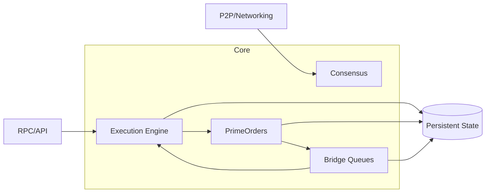
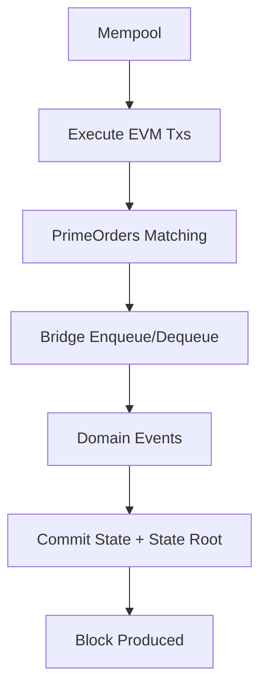
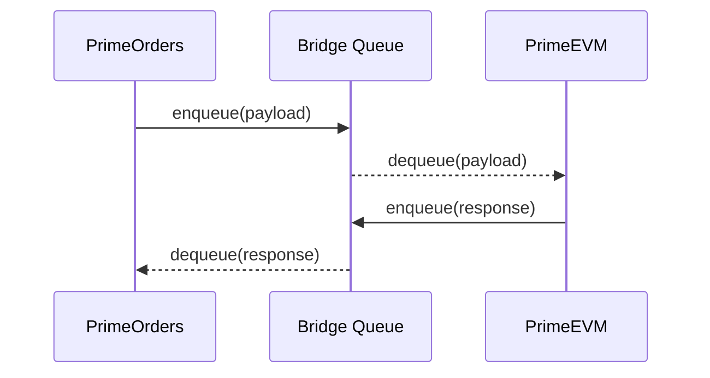
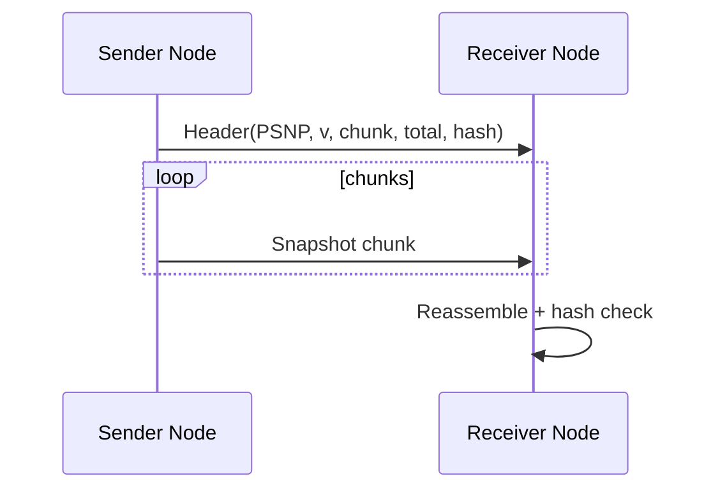

# Prime Chain Whitepaper (Technical Draft)

## Abstract
Prime Chain is a modular L1 with a deterministic execution engine, embedded matching engine (PrimeOrders), and a cross-domain bridge to an EVM execution environment. This document specifies core components, state transition rules, and validation constraints with formulas for fee markets, margining, and state roots.

## 1. System Overview
Prime Chain consists of:
- **Execution**: EVM execution using a deterministic state database.
- **Consensus**: BFT-style finality rounds and validator staking.
- **PrimeOrders**: Deterministic matching engine with margin controls.
- **Bridge**: Ordered queues connecting PrimeOrders ⇄ PrimeEVM.



Each block contains:
- EVM transactions + receipts + logs
- PrimeOrders events
- Bridge messages (orders→EVM, EVM→orders)
- State root over EVM + PrimeOrders + bridge queues

## 2. State Model
Let the global state be:
$S = (S_{evm}, S_{orders}, S_{bridge})$

Where:
- $S_{evm}$: account balances, nonces, storage
- $S_{orders}$: markets, order books, orders, accounts, positions
- $S_{bridge}$: queues $Q_{orders\to evm}$ and $Q_{evm\to orders}$

The block transition is:
$S_{t+1} = \mathcal{T}(S_t, B_t)$



## 3. State Root
State root commits all components:
$R = H(S_{evm}) \oplus H(S_{orders}) \oplus H(S_{bridge})$
Where $H(\cdot)$ is a deterministic hash over serialized state items and $\oplus$ is deterministic concatenation + hash.

## 4. Fee Market (EIP-1559 Style)
Target gas:
$G_{target} = \frac{G_{limit}}{\gamma}$

Base fee update:
$baseFee_{t+1} = baseFee_t \times \left(1 + \frac{G_{used} - G_{target}}{G_{target} \times D}\right)$

Where:
- $\gamma$ = elasticity multiplier
- $D$ = max change denominator

## 5. PrimeOrders Matching
Orders are matched price-time deterministically. For a market $m$:
- Best bid: max price in bid book
- Best ask: min price in ask book

A taker order of size $q$ matches against the opposite book:
$q_{fill} = \min(q_{remaining}, q_{maker})$

Each fill produces a trade record:
$T = (taker, maker, market, side, price, size)$

## 6. Margin and Liquidation
Let collateral for account $a$ be $C_a$ and position size $p$ at mark price $P$.

**Notional**:
$N = |p| \cdot P$

**Initial margin requirement**:
$IM = N \cdot \frac{m_{init}}{10{,}000}$

**Maintenance margin requirement**:
$MM = N \cdot \frac{m_{maint}}{10{,}000}$

Account equity $E_a$:
$E_a = C_a + \sum_i (p_i \cdot (P_i - P_{entry,i}))$

Liquidation condition:
$E_a < MM$

## 7. Bridge Queues
Bridge queues are ordered by nonce:
$Q = [m_1, m_2, \dots, m_n],\quad m_i.nonce < m_{i+1}.nonce$

Each enqueue increments a domain-specific nonce. Dequeue preserves FIFO order.



## 8. Domain Events
Each block emits a deterministic ordered event list:
$E_t = [e_1, e_2, \dots, e_k]$

Events include:
- Market added
- Order submitted/cancelled
- Trades
- Margin updates
- Bridge enqueue/dequeue

These events are included in the block and can be queried via RPC.

## 9. Snapshot Sync
Snapshots are serialized state bundles with a verification hash:
$H_{snapshot} = H(\text{snapshot bytes})$

Nodes accept a snapshot only if the computed hash matches the header.

### 9.1 TCP Chunked Transfer
Snapshots are streamed over TCP with a fixed header:
$ext{header} = ("PSNP", v, chunk\_size, total\_len, H_{snapshot})$

Receivers validate $H_{snapshot}$ after reassembly.



## 10. Node Identity + Peer Store
Each node persists a local identity key and a peer list for UDP gossip. Identity derives the node address:
$addr = \text{last}_{20}(\text{keccak256}(pubkey))$

## 11. Health + Operations
Nodes expose a health endpoint with height and chain ID for monitoring:
```
GET /health
```
Configuration hot-reload applies runtime parameters (mempool limits, fee market, slashing, margin, bridge limits) without restart.

## 12. Tokenomics (Deflationary Design)
Prime Chain targets a deflationary supply profile through a capped issuance schedule and fee-burning mechanics.

### 12.1 Supply Cap and Issuance
Maximum supply is capped at $S_{max}$. New issuance is defined by a halving schedule:
$R_t = \left\lfloor R_0 \cdot 2^{-\left\lfloor \frac{t}{H} \right\rfloor} \right\rfloor$

where:
- $R_0$ is the initial block reward
- $H$ is the halving interval in blocks

Total minted supply at height $t$:
$S_{minted}(t) = \sum_{i=0}^{t} R_i,\quad S_{minted}(t) \le S_{max}$

### 12.2 Fee Burning
Base fees are burned, reducing circulating supply:
$S_{burned}(t) = \sum_{i=0}^{t} baseFee_i \cdot gasUsed_i$

Net supply change over a window is:
$\Delta S = S_{minted} - S_{burned}$

Deflation occurs when $S_{burned} > S_{minted}$.

### 12.3 Economic Security
Validator rewards are funded from issuance (and optional tips), while slashing removes stake for faults. This aligns security incentives with correct consensus behavior and discourages malicious activity.

### 12.4 Considerations
Deflationary dynamics can improve scarcity but may increase the cost of transacting during high demand. Network parameters (gas limits, fee elasticity, reward schedule) must be tuned to balance security, usability, and long-term sustainability.

## 13. Future Work
- Full P2P networking and validator authentication
- Advanced funding + oracle integration
- Formal verification of matching and margin logic
